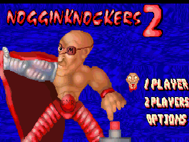
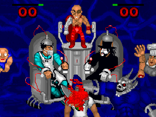
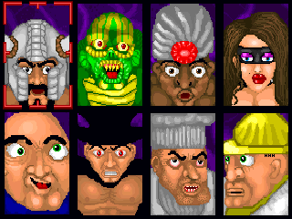

# Noggin Knockers 2 for 3DO

Version 1.0

<p align="center">
  
  
</p>

Nogginknockers 2 is Bloodlust Software's 1996 sequel to
[Nogginknockers](https://github.com/trapexit/3do-bls-nogginknockers):
more characters, more special moves, more blood, and more detailed graphics.

This repository contains a 3DO port constructed from the release-matching
source code and the original DOS executable and data. It preserves the
original 100 Hz game rules while adapting rendering, audio, input, storage,
and packaging to the 3DO. The options menu can also enable a narrowly scoped
fix for an original computer-player movement bug.


## Original README.TXT

[README.TXT](orig/exe/README.TXT)

>GAMEPLAY
>
>At the title screen you can pick from a 1 Player game, a 2 Player game, or
>options.
>
>At the selection screen, you can pick from 8 characters.
>
>This game is really easy to play. You just hit the bloody rotting severed
>head back and forth till you puke. It's almost as much fun as doing it in 
>real life (almost, not quite..but almost). To spice things up a bit, we threw 
>in some special attacks for each character. There are two different attacks
>that each character can make, and they are initiated by pressing either
>button on the joystick or pressing the defined keyboard key. Some attacks
>require the button to be held and then released (such as Buddy!'s drool or
>Ed Bujone's head grab).
>
>Each player has an energy meter, and each special move requires some energy.
>Some special attacks drain energy constantly as they are being used. You 
>replenish your energy by just hitting the severed-head back normally.
>Some attacks require a lot of energy, so use them sparingly.
>
>The winner of the round is the player who's score reaches the goal. The number
>of points needed to win can be changed in the options. In one player mode,
>you will have to battle each character and if you beat them all, you'll see
>a quick-thrown-together-ending that we did at the last minute.
>
>SPECIAL HINTS AND TASTY CHUNKS
>
>  *If Fetus happens to squirt some vernix on you, and you find yourself
>    moving really slow...move the controls up and down to shake off the
>    green goo.
>
>  *Although hugging people with Buddy! may seem addictive, you leave your
>    side open to an oncoming flying head.
>
>  *If you hit the head with Gurdip's Tool projectile, you will be able to
>    have control of the ball if you hold down the button, but your energy
>    will drain away faster than a hairless camel.


## Download

Prebuilt disc images are available on the [releases
page](https://github.com/trapexit/3do-bls-nogginknockers2/releases).


## How to play

Move to meet the head and return it to the other side. A point is scored when
the head passes an opponent's end of the arena. The default goal is three
points and can be configured from 1 to 25 in the options menu.

- **One player:** defeat each of the eight computer-controlled characters to
  reach the selected character's ending.
- **Two players:** play a first-to-the-configured-goal match using two
  controllers.
- **Attract mode:** leave the player-count menu idle for 15 seconds to watch
  two computer-controlled characters play. Any ordinary gameplay or menu
  input exits attract mode; X and L remain presentation-only.

### Controls

| 3DO control | Action |
| --- | --- |
| D-pad | Move or navigate menus |
| A | Use the character's first ability; confirm a menu choice |
| B | Use the character's second ability |
| Start | Confirm a menu choice; pause or resume a match |
| C | Cancel; during the introduction or a match, return to the title flow |
| X | Toggle aspect-corrected and raw 320x200 display scaling |
| L | Cycle 3DO display interpolation: off, vertical, horizontal, both |

Pausing is original behavior: the DOS release used Ctrl+P, while the 3DO port
maps it to Start during a match.


## The characters

<p align="center">
  
</p>

### Klubbor

Big guys like to bash little guys with big clubs. It has always been
this way, and Klubbor is no exception. Klubbor enters the
Nogginknockers contest to bash Stumpy, the leader of the Great Midget
Rebellion, because midgets are the epitome of all that is bashable.

- Bash:  Klubbor bashes the ball
- Bash Bash: Klubbor bashes the ball real hard (takes a lot of energy)


### Fetus

Squirmy little monster who was aborted by anti-abortionists to
demonstrate the cruelty of the act at a rally. Being anti-abortionist,
they botched the job and Fetus was the result. Now he seeks out Stumpy
in the Nogginknockers tournament because he knows Stumpy can build him
an artificial womb he can call home.

- Vernix Spit: Fetus hocks up vernix and uses it to slow down his opponent
- Tongue Lash: Fetus stretches his neck and fires out his tongue to reach
  the ball when it is high above him


### Hard Hat Henry
Henry lives to see big buildings come tumbling down. Remember that guy
you heard about who attacked the Berlin Wall in a bulldozer? That was
Henry in one of his disguises. Henry rides atop his Groundscraper 500
mini-bulldozer to try to find Stumpy's secret midget headquarters,
"The Nationwide Midget Emporium", the biggest and most potentially
destroyable building on the planet.

- Grab and Chuck: Henry shovels the ball up and pushes it forward.
  (if timed right when the ball contacts the 'dozer)
- Earth Mover: Henry plows a big rock at his opponent to knock them
  away from the ball


### Gurdip

Owner of a Quick-o-Mart which is slowly going bankrupt, Gurdip uses
his mystical cow god powers to hunt down Stumpy, who has an enormous
stash of money donated for the Great Midget Rebellion. If Gurdip
cannot get the money by selling Stumpy his Cherry Slushie stock, he is
prepared to hypnotize him to bend his will.

- Teeny Tiny: Gurdip fires a blast from his mystical gem that will
  shrink his opponent for a short amount of time, or, if it connects
  with the ball he has brief control of it as long as he holds the
  button down and has enough curry power to keep it going.
- Tool Displacement: Gurdip summons the powers of the cow god to
  teleport him directly in front of the ball.


### Cannibal Ed Bujone

Cannibal to some, Cannibal to others. Ed does not try to hide the fact
that he has a taste for human meat, in fact he owns many restaurants
which make all of their dishes from dead humans. Ed enters the
Nogginknockers tournament with his trusted meat cleaver because it is
common knowledge that athelete meat=the best meat.

- Meat Cleaver: Ed throws his trusted meat cleaver, Bessie, to deflect
  the ball or to hack into his opponent, draining their energy.
- Com'ere Child: Ed uses his severed arm paddle to grab the ball, if
  the button is held down, energy is drained and Ed holds onto the
  ball.


### Mistress Sinammon

Give an innocent librarian a leather whip for a Christmas joke and
this is what you get. Sinammon became one with her whip and realized
the power she held over men. Along with her sister Spice, Sinammon
just may be the worst thing for "man"kind since Mrs. Bobbit. Sinammon
enters the contest to find out if Stumpy is really more than just half
a man as he claims.
 
- Whippit: Sinammon whips up or down depending on where the ball is
  for greater range.
- Manslave: Sinammon sends one of her many male slaves to fetch and
  control the ball.


### Buddy!

Buddy Tardinski is the mascot for Bloodlust Software. After playing
our game, Timeslaughter, he suffered severe mental retardation. We
have adopted him (and his mom) to show the world what we are capable
of creating. Buddy enters the Nogginknockers tournament because we
told him to and we also promised him a groovy chick that he can hug.

- Drool: Buddy drools little bubbles which deflect the ball the longer
  the button is held, the further the drool moves.
- Huggy!: Buddy flies across the screen to give his opponent a hug.


### Gonzoles the Wonder Midget

By mixing the DNA of Hellbent Deathspew, Smegma, a goat, twenty virgin
midgets, a mini-fan, and Juan Valdez (we hand-picked every strand),
Bloodlust Midget Genetic Lab produced their ultimate warrior, Gonzoles
the Wonder Midget. Gonzoles started pumping iron as a wee little test
tube, so now he can dodge snails, win every limbo contest, reach the
discount cereal at the grocery store, is an expert mini-stilt sander,
and can leap a chair in a single bound. Gonzoles enters the contest to
free his creators so Stumpy so they can give him his greatest wish:
limb lengthening surgery. Gonzoles has the inherant midget ability to
fly around the screen, it is common knowledge that all midgets fly
well when propelled.

- Midget Drain: Gonzoles can fire bolts of raw midget power to drain
  his opponent's energy.
- Midget Dash: Gonzoles summons all of the midget particles in the air
  around himself to boost his speed until the button is released.


## Enhancements

The port keeps the original game rules but adds or changes presentation and
platform services:

- Attract mode: the original had no demo/attract mode. One was added
  if the title screen is left idle for 15 seconds.
- Scaling: the original MS-DOS game used "mode 13h" which is 320x200
  resolution with rectangular pixels. The 3DO uses 320x240 square
  pixels. As a result assets are vertically squashed. The 3DO port
  will perform a 6/5 scaling to all assets to make them fit the
  original 4:3 aspect ratio. However, due to the low resolution there
  can be some artifacting.
- Full screen banner: to reduce artifacting it was upscaled to
  3200x2000 using nearest-neighbor and then to 3200x2400 and down to
  320x240.
- Interpolation: By pressing L trigger you can cycle through the
  proprietary interpolation modes provided by the 3DO. off ->
  horizontal -> vertical -> both
- Restored music left out of the final release. 
- Platform integration: controller input, NVRAM-backed options,
  streamed music.
  

## Building

Building uses the current [3DO development
kit](https://github.com/trapexit/3do-devkit), which supplies the ARM
compiler, assembler, linker, Portfolio headers and libraries, and the
`modbin`, `3dt`, and `run-iso` tools. You also need GNU Make and a
shell supported by the DevKit. Git is needed to clone the repositories
and by `make distclean`.

### 1. Get the 3DO development kit

```sh
git clone https://github.com/trapexit/3do-devkit.git
```

The DevKit may live anywhere; it does not need to be inside this project.

### 2. Point the project at the DevKit

Either replace the contents of `.devkit-path` with the absolute path to the
DevKit checkout:

```text
/home/you/3do-devkit
```

or export the path for the current shell:

```sh
export TDO_DEVKIT_PATH=/home/you/3do-devkit
```

`TDO_DEVKIT_PATH` takes precedence over `.devkit-path`.

### 3. Activate the tools

From the repository root:

```sh
source activate-env
```

The script exports `TDO_DEVKIT_PATH`, adds the platform-appropriate compiler,
tool, and build-tool directories to `PATH`, and verifies that `armcc` is
available. Run `deactivate-env` to undo these shell changes.

Activation is recommended but not required for `make`: when
`TDO_DEVKIT_PATH` is unset, the Makefile reads `.devkit-path` and updates its
own `PATH`.

### 4. Build

```sh
make
```

The Makefile compiles the top-level `src/*.c` files into `build/`, links and
stamps `takeme/LaunchMe`, then packs the checked `takeme/` filesystem into
`iso/nogginknockers2.iso`.

| Command | Effect |
| --- | --- |
| `make` | Build the release binary with `-O2` and pack `iso/nogginknockers2.iso` |
| `make DEBUG=1` | Build with `-O0` and `-DDEBUG=1`; clean first when switching build modes |
| `make clean` | Remove `build/`, `iso/`, and `takeme/LaunchMe` |
| `make run` | Boot an already-built `iso/nogginknockers2.iso` through `run-iso` |
| `make distclean` | Run `make clean`, then `git clean -xfd`; this also deletes all untracked files |

`make distclean` is destructive. Review `git status` first, especially when
working with recovered source or other untracked material.

### Runtime assets and conversion tools

The CEL, AIFF, bundle, system, and banner files required by the game are
already checked under `takeme/`. An ordinary build does not run the conversion
tools and requires no generated asset directories.

`tools/export.py` can extract normalized game data from `orig/exe` into
`build/assets/normalized` and music data into `build/music/source`.
`tools/convert.py` converts those intermediates, regenerates
`src/nk_asset_bundle_data.c`, and replaces `takeme/nog2`.

To generate the files activate the DevKit and run:

```sh
python3 tools/export.py
python3 tools/convert.py
```

Asset regeneration additionally requires Python 3, `3it`, `ffmpeg`,
`ffprobe`, a C89 compiler, and a C++14 compiler. See
`python3 tools/convert.py --help` for tool overrides and the optional
hash-pinned SoundFont mode.


## Source and asset notice

All new code in this port is licensed under GNU GPL version 2; see
[`LICENSE`](LICENSE).

The historical Bloodlust Software source, the DOS executable and data
under `orig/exe`, and the game-derived runtime assets under `takeme/`
are not relicensed by the port's GPL notice.


## References

- https://archive.org/details/Nogginknockers2
- https://archive.org/details/bloodlust_software
- https://github.com/trapexit/bloodlust-software-src
